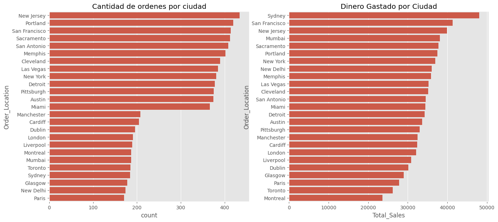
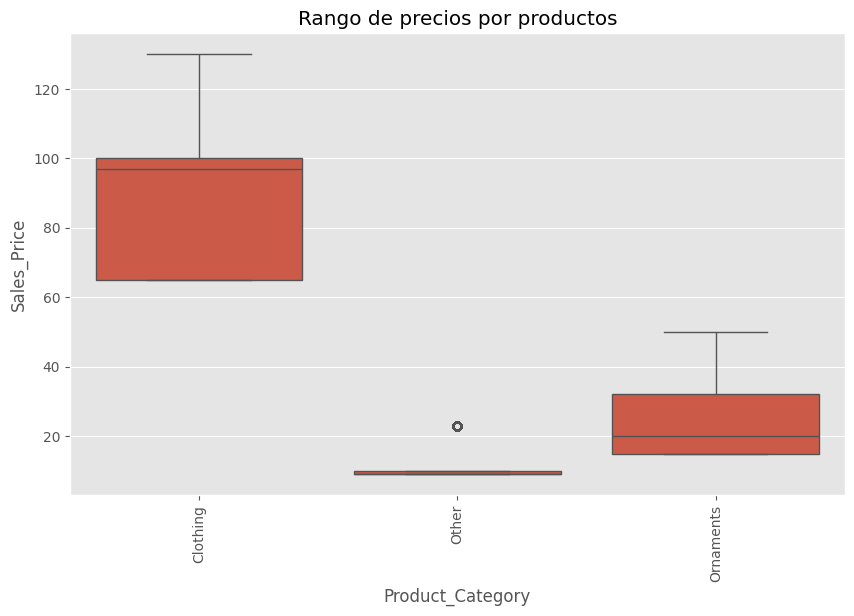
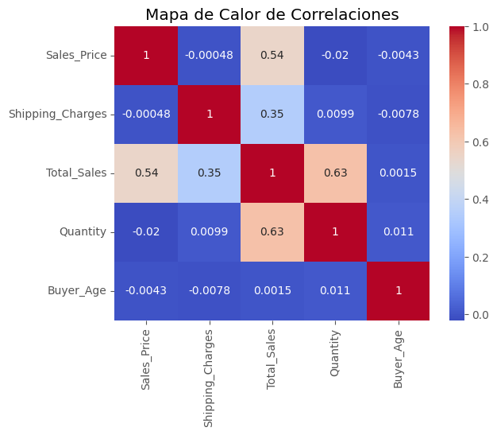

# Analisis Exploratorio  de Global Sales.


---

## 📋 Descripcion del proyecto

---

El **DataSet de Merch Sales** ofrece un conjunto de datos excelente para analizar patrones de ventas de una tienda online, como que ciudad/genero es la que mas ordenes realiza etc. A traves de este analisis queremos profundizar en descubrir mas patrones y ver que nos dicen los datos.

**Objetrivos Principales:**
- Identificar patrones de ventas.
- Analizar la distribución de los datos y tratar los outliers.
- Explorar relaciones entre variables categóricas y numéricas.
- Generar visualizaciones claras y atractivas que respalden los hallazgos.

---
## 🚀 Analisis Realizado

1. ### **Limpieza de Datos**
 - Eliminación de columnas irrelevantes, como Review.
 - Conversión de tipos de datos (fecha).

2. ### **Análisis Exploratorio**
 - Estadísticas Descriptivas:
    Medidas de tendencia central: Media, mediana y moda de las variables.
    Medidas de dispersión: Desviación estándar e IQR para identificar outliers.
    Medidas de forma: Skewness y kurtosis para entender la distribución de los datos.

3. ### **Pruebas Estadisticas**
 - Test Chi-cuadrado para evaluar la asociación entre variables categóricas.
 - ANOVA para comparar las medias de ventas totales por categoria de los proudctos.

4. ### **Visualizaciones:**
 - Gráfico de barras para comparar ventas totales y ordenes por ciudad:

 

 - Diagramas de caja para analizar la distribución de precios por productos.

 

 - Mapas de calor para representar correlaciones entre variables numéricas.

 

 5. ### **Tratamiento de Outliers**
 - Uso del rango intercuartílico (IQR) para detectar valores extremos.
 - Aplicación del test de Grubbs para identificar y evaluar outliers significativos.
 - Decisión de mantener ciertos outliers justificables teniendo en cuenta el conexto del conjunto de datos. (ejemplo: Pedidos grandes).

---

 ## 📂 Estructura del Proyecto  

```plaintext
├── data/                # Archivos del dataset  
├── notebooks/           # Jupyter Notebooks para el análisis exploratorio  y visualizaciones.
├── srcipts/             # Clases utilizadas para optimizar el Analisis Exploratorio.
├── README.md            # Descripción del proyecto (este archivo)  
```

---

## 🛠️ Herramientas y Librerías Utilizadas  

| Herramienta      | Uso                                                                 |
|------------------|---------------------------------------------------------------------|
| **Python** 🐍     | Lenguaje principal para manipulación y análisis de datos.         |
| **Pandas** 🐼     | Limpieza, transformación y análisis de datos tabulares.           |
| **Matplotlib** 🎨 | Creación de gráficos estáticos para visualización.                |
| **Seaborn** 📊    | Visualización avanzada de datos con gráficos estadísticos.         |
| **Scipy** 🔬      | Pruebas estadísticas e inferencia avanzada.                       |
| **Jupyter** 📓    | Entorno interactivo para escribir y ejecutar análisis paso a paso.|

---

## 📈 **Resultados Clave**📊 
 - Las ciudades con mayor gasto total en ventas son aquellas con mayor cantidad de pedidos.
 - Los productos en la categoría 'Clothing' generan el mayor volumen de ingresos.
 - Los clientes con pedidos grandes (cantidad o precio elevado) explican la mayoría de los outliers detectados.
 - No hay una asociación estadísticamente significativa entre el género del comprador y la categoría del producto comprado     (segun Test de Chi-cuadrado).

## **Conclusiones**
 - La categoría Clothing representa una oportunidad clave para aumentar las ventas mediante promociones.
 - Las ciudades de alto gasto pueden ser objetivo para campañas de marketing personalizadas.
 - La mayoria de ordenes son locales.
 - Los clientes con pedidos grandes (cantidad o precio elevado) explican la mayoría de los outliers detectados.
 


```
